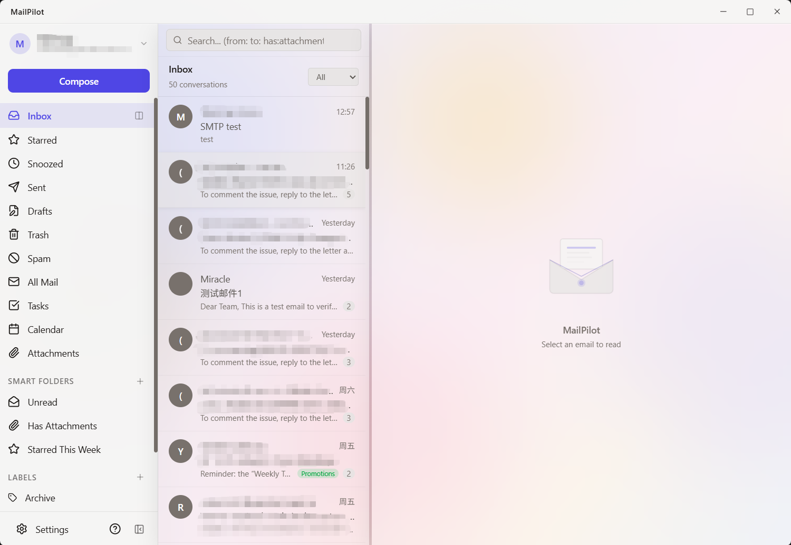

<p align="center">
  
</p>

<h1 align="center">MailPilot</h1>

<p align="center">
  <strong>Turn your inbox from a to-do list into an AI co-pilot cockpit.</strong>
</p>

<p align="center">
  An AI-first, keyboard-driven desktop email client built with Tauri, React, and Rust.<br />
  Local-first. Privacy-focused. Built for professionals who process 100+ emails a day.
</p>

<p align="center">
  <a href="#features">Features</a>&nbsp;&nbsp;&bull;&nbsp;&nbsp;
  <a href="#installation">Installation</a>&nbsp;&nbsp;&bull;&nbsp;&nbsp;
  <a href="docs/keyboard-shortcuts.md">Shortcuts</a>&nbsp;&nbsp;&bull;&nbsp;&nbsp;
  <a href="docs/architecture.md">Architecture</a>&nbsp;&nbsp;&bull;&nbsp;&nbsp;
  <a href="docs/development.md">Development</a>&nbsp;&nbsp;&bull;&nbsp;&nbsp;
  <a href="CONTRIBUTING.md">Contributing</a>
</p>

<p align="center">
  
</p>

---

## Why MailPilot?

Email is still the tool knowledge workers open most often — but three problems remain unsolved:

| Pain point | What MailPilot does |
| --- | --- |
| **Information overload** | AI auto-sorts incoming mail into action tiers so you scan in minutes, not hours |
| **Context switching** | One client for Gmail, Outlook, and IMAP — switch accounts without switching apps |
| **Broken AI workflows** | AI lives inside your inbox — summarize, draft, and search without copy-pasting to a browser tab |

MailPilot is a local-first, keyboard-driven email client where AI assists every step — but never sends on your behalf.

---

## Features

### AI Co-Pilot (Core)

MailPilot's four pillar AI capabilities:

| Capability | What it does |
| --- | --- |
| **Smart classification** | Auto-sorts mail into *Needs Reply*, *Notifications*, and *Follow Up* |
| **One-click draft replies** | AI generates 1–3 reply variants from thread context; pick one, tweak, and send |
| **Thread summaries** | Long threads get a short summary: topic, decisions, open items |
| **Natural language search** | Search like *"find the contract my boss sent last quarter"* |

Three cloud providers plus local LLM support:

| Provider | Models |
| --- | --- |
| **Anthropic Claude** | Haiku 4.5, Sonnet 4, Opus 4 |
| **OpenAI** | GPT-4o Mini, GPT-4o, GPT-4.1 Nano, GPT-4.1 Mini, GPT-4.1 |
| **Google Gemini** | 2.5 Flash, 2.5 Pro |
| **Local (Ollama)** | Bring your own model — data stays on your machine |

Writing-style learning, Ask My Inbox, smart replies, and AI compose. All results cached locally.

> AI never sends on your behalf — every draft requires you to press Send.

### Email

- Multi-account support: Gmail (OAuth/API) and IMAP/SMTP (Outlook, Yahoo, iCloud, Fastmail, and more)
- Threaded conversations with collapsible messages
- Full-text search with Gmail-style operators (`from:`, `to:`, `subject:`, `has:attachment`, `label:`, etc.)
- Command palette (`/` or `Ctrl+K`) for quick actions
- Drag-and-drop labels, multi-select, pin threads, mute threads, context menus
- Split inbox with category tabs (Primary, Updates, Promotions, Social, Newsletters)
- Inline reply, contact sidebar with Gravatar

### Composer

- TipTap v3 rich text editor (bold, italic, lists, code, links, images)
- Undo send, schedule send, auto-save drafts
- Multiple signatures, reusable templates with variables
- Send-as email aliases with from-address selector
- Drag-and-drop attachments with inline preview
- Frequency-ranked contact autocomplete

### Smart Inbox

- Snooze threads with presets or custom date/time — with follow-up reminders when no reply arrives
- Filters to auto-label, archive, trash, star, or mark read
- AI + rule-based auto-categorization
- One-click unsubscribe (RFC 8058) and subscription manager
- Newsletter bundling with delivery schedules
- Smart folders / saved searches with dynamic query tokens
- Quick steps — custom action chains for batch thread processing

### UI & Design

- Glassmorphism with animated gradient background
- Dark / light / system theme with 8 accent color presets
- Flexible reading pane (right, bottom, hidden), resizable panels
- Configurable density and font scaling
- Pop-out thread windows, custom titlebar, splash screen
- System tray with taskbar badge count

### Privacy & Security

- **Local-first** — emails stored in encrypted SQLite; read mail offline
- OAuth PKCE for Gmail — no client secret, no backend servers
- Encrypted password/app-password storage for IMAP accounts (AES-256-GCM)
- Remote image blocking with per-sender allowlist
- Phishing link detection with 10 heuristic scoring rules
- SPF/DKIM/DMARC authentication display with badges and warnings
- DOMPurify + sandboxed iframe rendering

### System Integration

- `mailto:` deep links, global compose shortcut
- Autostart (hidden in tray), single instance
- [Customizable keyboard shortcuts](docs/keyboard-shortcuts.md) — `j/k` navigate, `r` reply, `s` star, `e` archive

---

## Installation

Download the latest release for your platform:

**[Download MailPilot](https://github.com/brucefengmm/MailPilot/releases/latest)** — Windows `.msi` / `.exe` &bull; macOS `.dmg` &bull; Linux `.deb` / `.AppImage`

No build tools required — download, install, and run.

### Account setup

**Gmail:** Create OAuth credentials in [Google Cloud Console](https://console.cloud.google.com/) (enable Gmail API), then enter your Client ID in MailPilot Settings. No client secret needed (PKCE).

**IMAP/SMTP:** Click "Add IMAP Account" in the account switcher. MailPilot auto-discovers settings for Outlook, Yahoo, iCloud, Fastmail, and more.

**AI (optional):** Add an API key for [Anthropic](https://console.anthropic.com/), [OpenAI](https://platform.openai.com/), or [Google Gemini](https://aistudio.google.com/) in Settings. Or point to a local [Ollama](https://ollama.com/) instance.

### Building from source

```bash
git clone https://github.com/brucefengmm/MailPilot.git
cd MailPilot
npm install
npm run tauri dev
```

**Prerequisites:** [Node.js](https://nodejs.org/) v18+, [Rust](https://www.rust-lang.org/tools/install), [Tauri v2 deps](https://v2.tauri.app/start/prerequisites/)

See [Development Guide](docs/development.md) for all commands, testing, and build instructions.

---

## Tech Stack

| | |
| --- | --- |
| **Framework** | Tauri v2 (Rust) + React 19 + TypeScript |
| **Styling** | Tailwind CSS v4 |
| **State** | Zustand 5 (9 stores) |
| **Editor** | TipTap v3 |
| **Email** | Gmail API, IMAP/SMTP (async-imap + lettre) |
| **Database** | SQLite + FTS5 (37 tables) |
| **AI** | Claude, GPT, Gemini, Ollama |
| **Testing** | Vitest + Testing Library |

See [Architecture](docs/architecture.md) for detailed design, data flow, and project structure.

---

## Building

```bash
npm run tauri build
```

**Windows** `.msi` / `.exe` &bull; **macOS** `.dmg` / `.app` &bull; **Linux** `.deb` / `.AppImage`

## License

[Apache-2.0](LICENSE)

---

Built with Rust and React.
